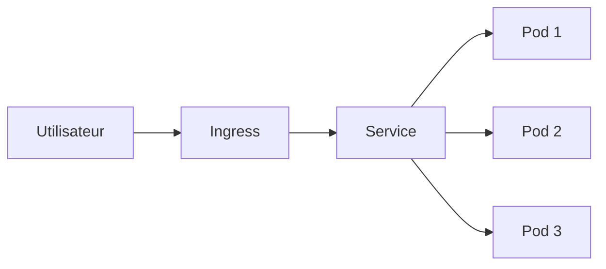

# Deployments

!!! note "Définition"
    Un Deploymet permet de déclarer l'état souhaité detes Pods Kubernetes.

## Créer un Deployment

!!! tip "Bonne patrique"
    Utilise toujours 'kubectl apply -f' plutôt que 'kubectl create' pour pouvoir mettre à jour facilement.

!!! warning "Attention"
    Ne modifie jamais directementles Pods créés par un Deployment, ils seront recréés.

## Architecture Kubernetes

